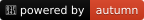

# badge

Библиотека позволяет создавать SVG-бейджи различных стилей для отображения статусов, версий, метрик и другой информации.

## Поддерживаемые стили

| flat | flat-square | plastic | for-the-badge | social | gitlab-scoped |
|---|---|---|---|---|---|
|  |  |  |  |  |  |


## Установка

```bash
opm install badge
```

## Быстрый старт

```bsl
Конфигурация = Новый КонфигурацияБейджа("build", "passing", "#4c1");

Бейдж = Новый Бейдж(Конфигурация);
Бейдж.СохранитьВФайл("./badge.svg");
```

**Результат:**


### Экспорт в различных форматах

```bsl
// Получение SVG
SVG = Бейдж.ПолучитьSVG();

// Получение Base64-строки
Base64Строка = Бейдж.ПолучитьBase64();

// Получение Data URL для встраивания в HTML
DataURL = Бейдж.ПолучитьDataURL();
```

## Примеры использования

### OneScript в стиле flat


```bsl
Конфигурация = Новый КонфигурацияБейджа("OneScript", "v2.0.0");
Конфигурация.Логотип = "onescript";
```

### OneScript в стиле for-the-badge


```bsl
Конфигурация = Новый КонфигурацияБейджа("OneScript", "v2.0.0");
Конфигурация.Стиль = "for-the-badge";
Конфигурация.Логотип = "onescript-plain";
Конфигурация.ЦветТекстаЗаголовка = "#333";
Конфигурация.ЦветФонаЗаголовка = "#EDEDED";
Конфигурация.ЦветФонаЗначения = "#4F90D6";
```

### Powered by autumn



```bsl
Конфигурация = Новый КонфигурацияБейджа("🍁 powered by", "autumn");
Конфигурация.ЦветФонаЗаголовка = "#000";
Конфигурация.ЦветФонаЗначения = "#D93D1F";
```

### Infostart


```bsl
Конфигурация = Новый КонфигурацияБейджа("Infostart", "№1");
Конфигурация.Логотип = "infostart-plain";
Конфигурация.ЦветЛоготипа = "#fff";
Конфигурация.ЦветФонаЗаголовка = "#435290";
Конфигурация.ЦветФонаЗначения = "#2F3A6B";
```

### OpenYellow


```bsl
Конфигурация = Новый КонфигурацияБейджа("OpenYellow", "Ranked");
Конфигурация.Логотип = "OpenYellow";
Конфигурация.ЦветФонаЗначения = "#dfb317";
```

## API

### Класс `Бейдж`

Основной класс для создания и экспорта бейджей.

#### Синтаксис

`Новый Бейдж(<Конфигурация>)`

#### Параметры

<ins><Конфигурация> (необязательный)</ins></br>
Тип: _КонфигурацияБейджа_.

#### Методы

- `ПрименитьКонфигурацию(<Конфигурация>)` - Применяет новую конфигурацию
- `ПолучитьSVG()` - Возвращает готовый SVG-код бейджа
- `ПолучитьDataURL()` - Возвращает бейдж в формате Data URL
- `ПолучитьBase64()` - Возвращает SVG бейджа, закодированный в Base64
- `СохранитьВФайл(<ПутьКФайлу>)` - Сохраняет SVG бейджа в указанный файл на диске

### Класс `КонфигурацияБейджа`

Класс для настройки всех параметров внешнего вида бейджа.

#### Синтаксис

`Новый КонфигурацияБейджа(<Заголовок>, <Значение>, <Цвет>)`

#### Параметры

<ins><Заголовок> (необязательный)</ins></br>
Тип: _Строка_.</br>
Текст заголовка бейджа.</br>
<ins><Значение> (необязательный)</ins></br>
Тип: _Строка, Число_.</br>
Значение бейджа.</br>
<ins><Цвет> (необязательный)</ins></br>
Тип: _Строка_.</br>
Цвет фона значения.

#### Поля

Текстовое содержимое:
- `Заголовок` - `Строка` - Текст заголовка бейджа (левая часть).
- `Значение` - `Строка`, `Число` - Основное значение бейджа (правая часть).
- `ПрефиксЗначения` - `Строка` - Текст, добавляемый перед значением (например: `≈`, `$`, `v`).
- `СуффиксЗначения` - `Строка` - Текст, добавляемый после значения (например: `%`, `ms`, `lines`).

Стиль:
- `Стиль` - `СтилиБейджей` - Стиль оформления бейджа (по умолчанию: `flat`).

Логотип:
- `Логотип` - `Строка` - Имя логотипа из `assets/icons`, либо base64-строка, либо полный Data-URL изображения.
- `ЦветЛоготипа` - `Строка` - Цвет логотипа в HEX-формате.
- `ШиринаЛоготипа` - `Число` - Ширина логотипа.
- `ОтступЛоготипа` - `Число` - Отступ вокруг логотипа, влияющий на общую ширину бейджа.

Цвета:
- `ЦветТекстаЗаголовка` - `Строка` - Цвет текста заголовка в HEX-формате.
- `ЦветТекстаЗначения` - `Строка` - Цвет текста значения в HEX-формате.
- `ЦветФонаЗаголовка` - `Строка` - Цвет фона заголовка в HEX-формате.
- `ЦветФонаЗначения` - `Строка` - Цвет фона значения в HEX-формате.
- `ЦветТениЗаголовка` - `Строка` - Цвет тени текста заголовка в HEX-формате (используется в стилях `flat` и `plastic`).
- `ЦветТениЗначения` - `Строка` - Цвет тени текста значения в HEX-формате (используется в стилях `flat` и `plastic`).

Ссылки:
- `СсылкаЗаголовка` - `Строка` - Ссылка, привязанная к заголовку (используется в стиле `social`).
- `СсылкаЗначения` - `Строка` - Ссылка, привязанная к значению (используется в стиле `social`).

Параметры текста:
- `РазмерШрифта` - `Число` - Размер шрифта текста бейджа.
- `ШиринаСимволаЗаголовка` - `Число` - Базовая ширина одного символа для расчёта ширины заголовка.
- `ШиринаСимволаЗначения` - `Число` - Базовая ширина одного символа для расчёта ширины значения.
- `КоличествоСимволовОтступа` - `Число` - Дополнительный горизонтальный отступ внутри блоков заголовка и значения (в долях ширины шрифта).
- `МасштабТекста` - `Число` - Коэффициент масштабирования текста.

Дополнительно:
- `Макет` - `Строка` - SVG-макет бейджа, используемый для генерации итогового изображения.
- `ТипКалькулятораГеометрии` - `Тип` - Тип класса калькулятора геометрии бейджа на базе [`ИнтерфейсКалькулятораГеометрииБейджа`](./src/Интерфейсы/ИнтерфейсКалькулятораГеометрииБейджа.os).

### Перечисление `СтилиБейджей`

- `Flat` - плоский стиль с лёгкой тенью
- `FlatSquare` - плоский стиль с острыми углами
- `Plastic` - объёмный стиль с градиентом
- `ForTheBadge` - крупный стиль с заглавными буквами
- `Social` - стиль в формате социальных сетей
- `GitlabScoped` - стиль в формате GitLab
